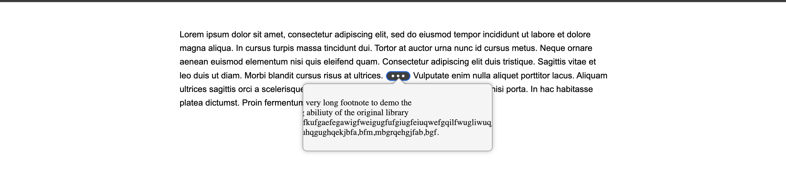
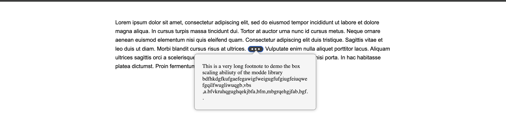

# littlefoot.js Modified by Team 6

## Changes Made

* We romoved the scrolling feature of the original littlefoot library as it made it difficult to read long footnotes whilst constantly scrolling.
* We added a feature to allow the user to see the entire fotnote in a single bounding box dynamically.

## Logic

* We modified the original littlefoot libraries dom manipulation file scroll.ts to dynamically create the box size based on the footnote length and present the footnote wrapped in a bounding box.


## Installation

Install using NPM:

```shell
npm install --save littlefoot
```

Install using Yarn:

```shell
yarn add littlefoot
```

then run:

```shell
npm run build
```

## Usage

Please follow the original littlefoot documentation for usage instructions.

To run see a demo of the changes made working please run the including demo.html to get started quickly.


## Outputs:

###Before:




____________________________________________________________________________________________________________________

###After:


